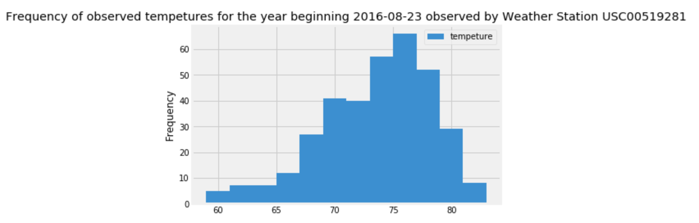

# API for Hawaii weather data

The goal of this project was to create a flask app API that will query a SQLite database to retun weather data in Hawaii. The data is stored in a SQLite database, while SQLAlchemy was utilized to retreive and manipulate the data within the flask app. Analysis of the data, including visualizations was completed using Python libraries Pandas, Numpy and Matplotlib in a Jupyter Notebook. 

## Analysis Questions

1. How much precipitation did Hawaii get during the last year of my dataset?

2. Which weather stations had the most weather observations?

3. What are the most frequent tempeture observations recorded by the most active weather station over the last year of my dataset? 

4. Are the tempetures measured in the month of June statistically significantly different from the tempetures measued in the month of December? 

## Flask API endpoints

### Base Route

1. List of all available routes

### Static Routes

1. How much precipitation did Hawaii receive each day in my dataset?

2. Which weather stations are providing data in my dataset? 

3. What are the tempeture observations recorded in the last year of my dataset? 

### Dynamic Routes

1. What are the minimum, maximum and average tempetures from a given start date through the last date in my dataset?

2. What are the minimum, maximum and average tempetures in a given date range? 

## Tasks

### Analysis questions

1. Connect to SQLite Database ("DB") using SQLAlchemy, and reflect the tables.

2. Calculate the latest date in my dataset, and use this to calculate the last year in my dataset.

3. Use SQLAlchemy to query DB to find the amount of precipitation and the date, filterd by the date range in step 2 above. 

4. Plot results from step 3 above into a Matplotlib chart

5. Use SQLAlchemy to query DB to find the Weather Station ID, and how many rows each Weather Station ID appears in, and order the results by how many rows each Weather Station ID appears in. 

6. Modify the query in step 6 above to return only the first result, and save only the Weather Station ID into a variable

7. Use SQLAlchemy to query the DB to find the date and tempature, filtered by the Weather Station ID found in step 6 above, and by the date range found in step 2 above. 

8. Use Matplotlib to show the tempeture and frequency of the tempeture, grouped into 12 bins. 

9. Create two DB queries that find the Weather Station ID, and the average observed tempeture, grouped by the Weather Station ID, one that filters by the measurement date being in June, and one that filters by the measurement date being in December

10. Run a for loop that loops through the results of both queries in step 9 above, and appends the average observed tempeture into a list. 

11. Run a t-test to determine if the tempetures in December are the same as the tempetures as in June. 

12. Review results from step 11 above to determine if the null hypothesis can be rejected

## Flask API endpoints

### Base Route

1. Define a route and corresponding function that returns text listing all of the API endpoints

### Static Routes

#### How much precipitation did Hawaii get each date in my dataset?

1. Define flask route and corresponding function

Within the function defined in step 1 above:

2. Connect to the DB, query the DB to find the date and precipitation amount, and close the connection to the DB.

3. Create an empty list to store the results. 

4. Run a for loop that loops through the results from step 2 above, that will check if the precipitation value is 'None', if so, set the value of a second precipitation variable (with a minor spelling difference) ("2nd Precipitation Variable") to "0.0", and if not, set the 2nd Precipitation Variable to the precipitation result. Next the for loop will create an empty dictionary, set the date value of the result to the key,  the value of the 2nd Precipitation Variable to the value, and append the dictionary to the list created in step 3 above.

5. Return the list created in step 3 above after passing it through the jsonify function from the flask library.

#### Which weather stations had the most weather observations?

1. Define flask route and corresponding function

Within the function defined in step 1 above:

2. Connect to the DB, query the DB to find the unique Weather Stations IDs, grouped by the Weather Station ID, and ordered by the count of the Weather Station ID.

3. Flatten the result in step 2 above into a 1-dimensional array, and transform it into a list.

4. Return the list created in step 3 above after passing it through the jsonify function from the flask library

#### What are the tempeture observations recorded in the last year of my dataset? 

1. Define flask route and corresponding function

Within the function defined in step 1 above:

2. Connect to the DB, query the DB to find the latest date in the dataset and save the result to a variable. Use datetime.timedelta to calculate 365 days (one year) before the aforementioned result, and save this value to a varaible. 

3. Query the DB to find the date and observed tempeture, filtering date values greater than or equal to the last variable defined in step 2, and close the connection to the DB.

4. Create empty list to store results. 

5. Run a for loop that loops through the results from step 3 above that creates an empty dictionary, saves the date result for each result as the key and the observed tempeture as the value, and appends the dictionary to the list created in step 4 above.

6. Return the list created in step 4 above after passing it through the jsonify function from the flask library

### Dynamic Routes

1. Define flask route and corresponding function

Within the function defined in step 1 above:

2. Check if each input variable is in yyyy-mm-dd format, if not return a pre-defined error message, and if in the appropiate format, move on to step 3 below.

3. Connect to the DB, query the DB to find the minimum, maximum and average observed tempeture, and the date, grouping by the date, filtering by dates greater than or equal to the first input variable (if applicable: and less than or equal to the second input variable) and close the connection to the DB. 

4. Create an empty list for the results.

5. Run a for loop that loops through the results from step 3 above that creates two empty dictionaries. The first dictionary will have keys of 'min_temp', 'max_temp', and 'average_temp' and their respective values will be the values from the result. The first dictionary will be passed into the second dictionary with the date being the key and the first dictionary being the value. The second dictionary will be passed into the list created in step 4 above. 

6. Return the list created in step 4 above after passing it through the jsonify function from the flask library.

### Deployment

I deployed the flask app at https://weather-api-492.herokuapp.com 

### Datasets

1. https://github.com/jherberg462/weather-api-flask-sqlalchemy/blob/master/data/hawaii.sqlite

## Results

### Precipitation from the last year in my dataset

### Weather stations

### Frequency of tempeture observations

### Comparing June and December tempetures

